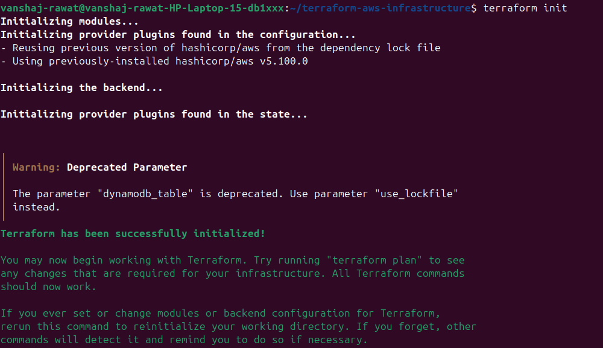
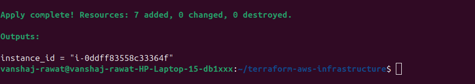
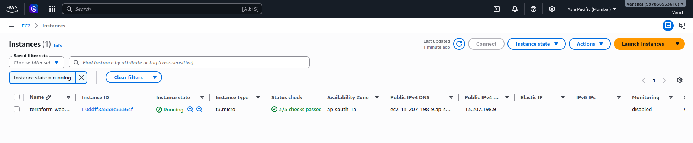
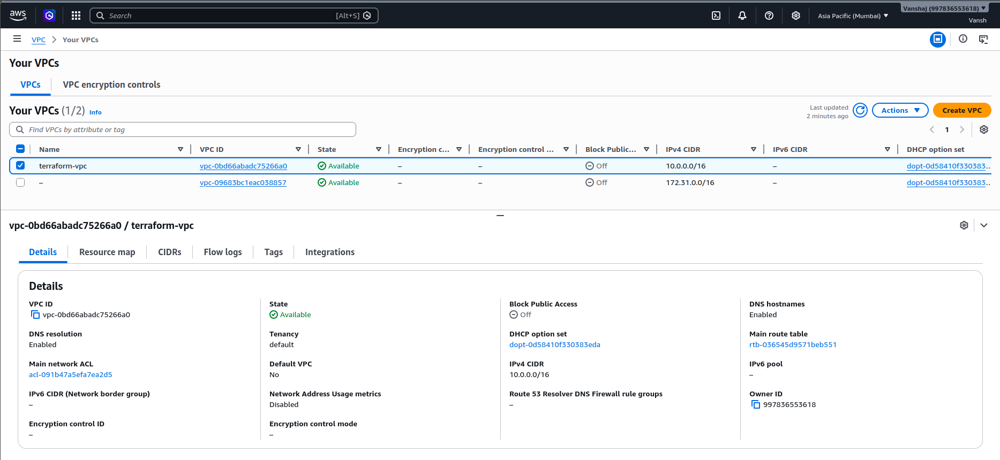
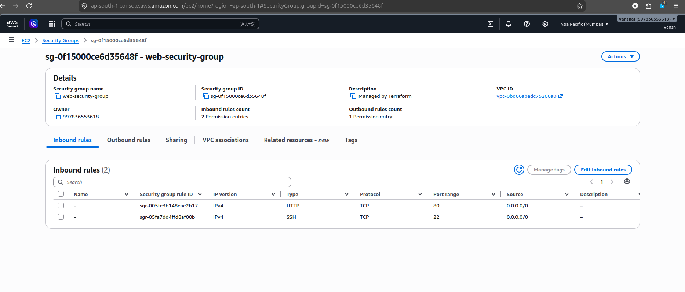
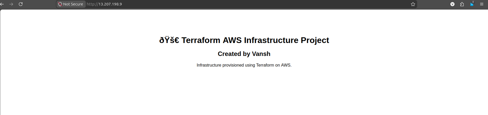
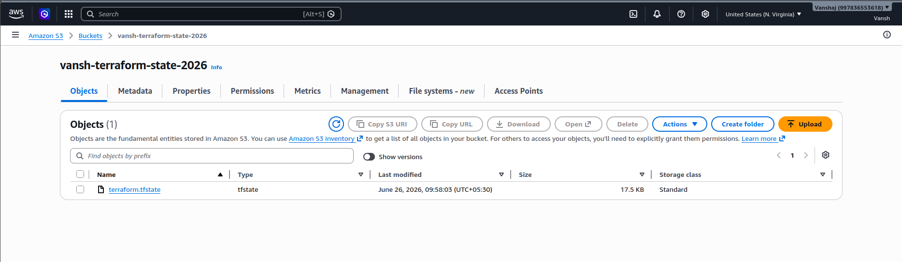
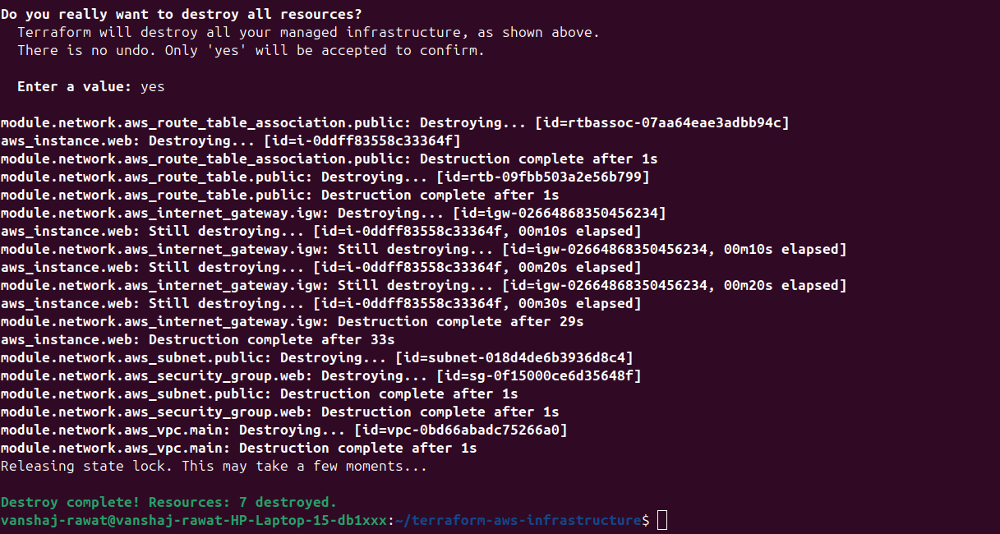

<div align="center">

# 🚀 Terraform AWS Infrastructure Automation

Provisioning AWS Infrastructure using **Terraform (Infrastructure as Code)**.


> 🚀 End-to-end AWS infrastructure provisioning using Terraform with a custom VPC, EC2, Security Groups, S3 remote state, and DynamoDB state locking.
</div>

---

# 📖 Overview

This project demonstrates the use of **Terraform** to automate the provisioning of AWS infrastructure following **Infrastructure as Code (IaC)** principles.

The infrastructure includes:

- 🌐 Virtual Private Cloud (VPC)
- 📡 Public Subnet
- 🌍 Internet Gateway
- 🛣️ Route Table & Route Table Association
- 🔒 Security Group
- 💻 Amazon EC2 Instance
- 🚀 Automatic Nginx Installation using `user_data`
- ☁️ Remote Terraform State using Amazon S3
- 🔐 State Locking using DynamoDB

---
## 📑 Table of Contents

- 📖 Overview
- 🏛️ Architecture
- ✨ Features
- 🛠️ Technologies Used
- 📂 Project Structure
- ⚙️ Prerequisites
- 🚀 Quick Start
- 📸 Screenshots
- 📚 Skills Demonstrated
- 🎯 Resume Highlights
- 🚀 Future Improvements
- 👨‍💻 Author

# 🏛️ Architecture

> Add your architecture diagram here.

<p align="center">

</p>

---

# ✨ Features

- ✅ Infrastructure as Code using Terraform
- ✅ Modular Terraform Configuration
- ✅ Custom AWS Networking
- ✅ Automated EC2 Deployment
- ✅ Automatic Nginx Installation
- ✅ Remote State Management
- ✅ DynamoDB State Locking
- ✅ Reusable Infrastructure

---

# 🛠️ Technologies Used

| Technology | Purpose |
|------------|---------|
| Terraform | Infrastructure as Code |
| AWS EC2 | Virtual Machine |
| AWS VPC | Networking |
| AWS S3 | Remote Terraform State |
| AWS DynamoDB | State Locking |
| Git | Version Control |
| GitHub | Repository Hosting |

---

# 📂 Project Structure

```text
terraform-aws-infrastructure/
│
├── .github/
│   └── workflows/
│
├── images/
│   └── architecture.png
│
├── screenshots/
│   ├── 01-terraform-init.png
│   ├── 02-terraform-apply.png
│   ├── 03-ec2-instance.png
│   ├── 04-vpc.png
│   ├── 05-security-group.png
│   ├── 06-nginx-page.png
│   ├── 07-s3-backend.png
│   └── 08-terraform-destroy.png
│
├── modules/
│
├── main.tf
├── provider.tf
├── variables.tf
├── outputs.tf
├── example.tfvars
├── README.md
└── .gitignore
```

---

# ⚙️ Prerequisites

Before starting, ensure you have:

- Terraform
- AWS CLI
- AWS Account
- Git
- GitHub Account

---

# 🚀 Quick Start

### 1. Clone the repository

```bash
git clone https://github.com/yourusername/terraform-aws-infrastructure.git
cd terraform-aws-infrastructure
```

### 2. Create a Terraform variables file

Copy the example file:

```bash
cp example.tfvars terraform.tfvars
```

Edit `terraform.tfvars` and replace the placeholder with your AWS EC2 key pair name.

```hcl
key_name = "your-key-pair-name"
```

### 3. Initialize Terraform

```bash
terraform init
```

### 4. Validate the configuration

```bash
terraform validate
```

### 5. Preview the infrastructure

```bash
terraform plan
```

### 6. Deploy the infrastructure

```bash
terraform apply
```

Type:

```text
yes
```

when prompted.

### 7. Access the web server

Open your browser:

```text
http://<EC2_PUBLIC_IP>
```

You should see the default **Nginx Welcome Page**.

### 8. Destroy the infrastructure

```bash
terraform destroy
```
---
# 🔄 Project Workflow

```text
Clone Repository
        │
        ▼
terraform init
        │
        ▼
terraform validate
        │
        ▼
terraform plan
        │
        ▼
terraform apply
        │
        ▼
AWS Infrastructure Created
        │
        ▼
Access Nginx via Public IP
        │
        ▼
terraform destroy
```

---
# 📸 Project Screenshots

## Terraform Initialization

<p align="center">

</p>

---

## Terraform Apply

<p align="center">

</p>

---

## EC2 Instance Running

<p align="center">

</p>

---

## VPC Configuration

<p align="center">

</p>

---

## Security Group

<p align="center">

</p>

---

## Nginx Successfully Running

<p align="center">

</p>

---

## Remote State Backend (S3)

<p align="center">

</p>

---

## Infrastructure Destroyed

<p align="center">

</p>

---
# 🎓 Learning Outcomes

Through this project, I gained hands-on experience with:

- Infrastructure as Code (IaC)
- AWS Networking (VPC, Subnets, Route Tables)
- Amazon EC2 provisioning
- Security Group configuration
- Remote Terraform state using Amazon S3
- State locking with DynamoDB
- Git and GitHub version control
  
---
# 📚 Skills Demonstrated

- Terraform
- Infrastructure as Code (IaC)
- AWS Networking
- Amazon EC2
- VPC Configuration
- Security Groups
- Remote State Management
- DynamoDB State Locking
- Git
- GitHub
- Cloud Infrastructure Automation

---

# 🎯 Resume Highlights

- Automated AWS infrastructure provisioning using Terraform.
- Designed reusable Infrastructure as Code modules for networking resources.
- Configured Amazon S3 as a remote backend with DynamoDB state locking.
- Provisioned a secure EC2 instance inside a custom VPC.
- Automated Nginx installation using Terraform `user_data`.
- Followed Infrastructure as Code best practices for repeatable deployments.

---

# 🚀 Future Improvements

- HTTPS using Let's Encrypt
- Load Balancer (ALB)
- Auto Scaling Group
- Multi-AZ Deployment
- Terraform Workspaces
- CI/CD with GitHub Actions
- Monitoring using Amazon CloudWatch

---
# 📄 License

This project is licensed under the MIT License.

# 👨‍💻 Author

**Vanshaj Rawat**

📧 Email: your-email@example.com

🔗 GitHub: https://github.com/yourusername

---

<div align="center">

⭐ If you found this project helpful, consider giving it a star!

</div>
